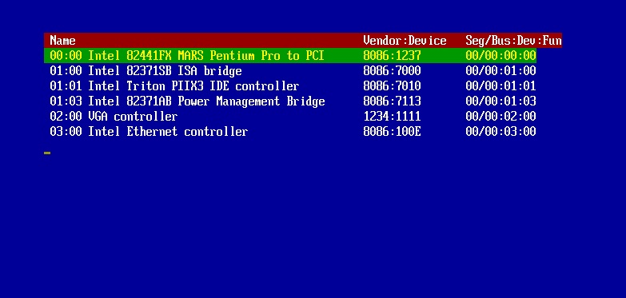
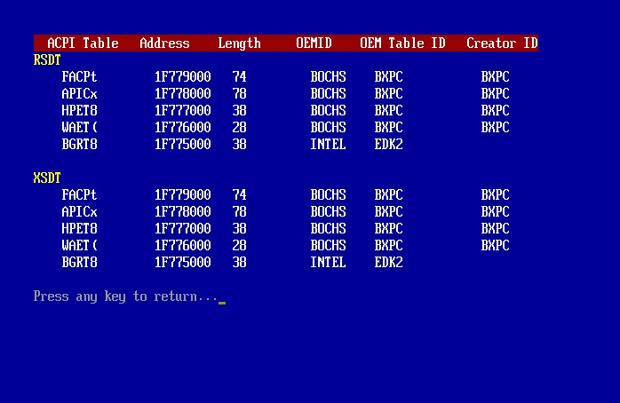
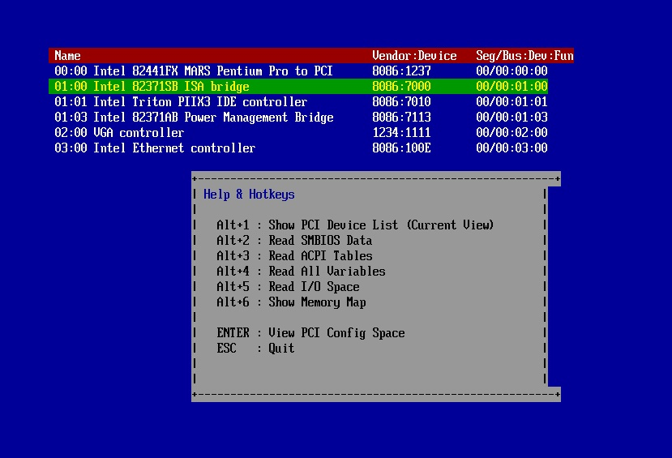

# MiUPkg — UEFI Text-Mode System Explorer

|   |   |
|---|---|
| **Build** | `git clone --recurse-submodules …` `cd MiUPkg` `edk2\edksetup.bat` `build -a X64 -b RELEASE -t VS2022 -p MiUPkg/MiUPkg.dsc` |
| **Features** | • Memory map viewer • PCI/SMBIOS explorer • Variable browser |
| **Screenshot** |    |
